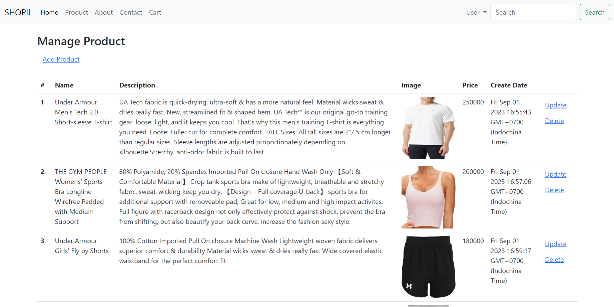
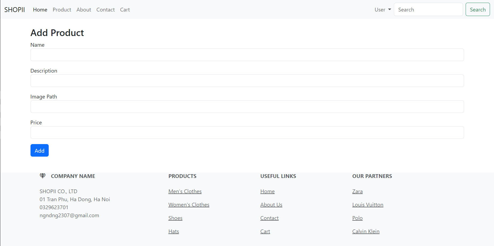

# shopii - version2
#### Shopii is a clothing e-commerce web application.
#### This is a simple project using node.js and express.js.
#### Dependencies which I used: express, nodemon, express-handlebars, mongoose, jsonwebtoken, cookie-parser
#### There are two roles: user and admin.
#### Users can create a new account, login, view product, add product to cart, view cart, and order.
#### Admin can manage products (using CRUD operations): view product list, add product, update product, delete product.
## Login page

## Register page

## Home page

## Product page

## Product detail page

## Cart page

## Payment page

## Admin home page

## Add product page

## Update product page

## Delete product page

